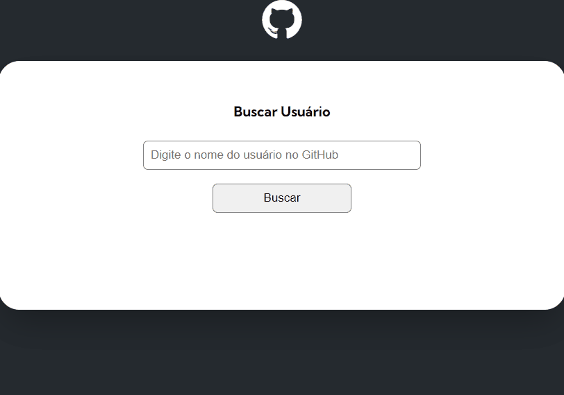
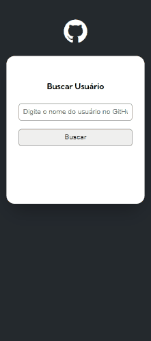
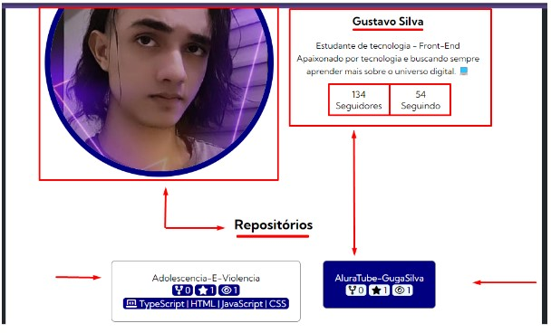
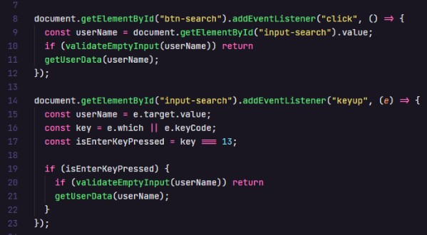
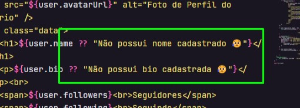
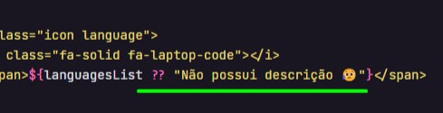
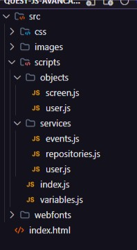
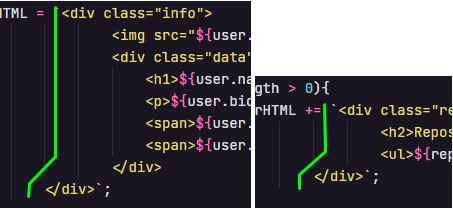
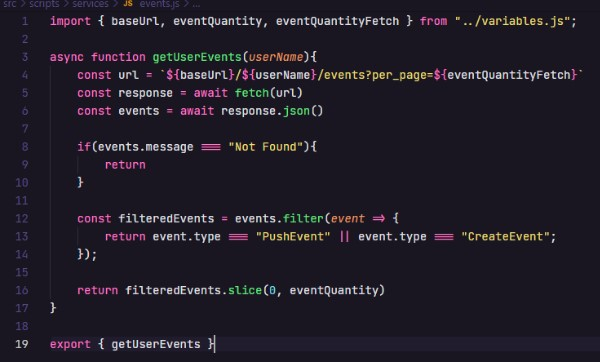

<h1 align="center">API GitHub - Pesquisando Usuários no GitHub</h1>
<br>

<p align="center">3° Desafio do curso com Feedback</p> 
<br>

<div>
    <h3 align="center"><strong>Desktop View</strong><h3>
    <a href="https://thaleshng.github.io/quest-js-avancado/" target="_blank"></a> 
</div>

<div align="center">
    <h3 align="center"><strong>Mobile View</strong><h3>
    <a href="https://thaleshng.github.io/quest-js-avancado/" target="_blank"></a> 
</div>

<div align="center">
    
    
    
    <br>
    
    <br>
    
</div>

<br>


<div align="center">
    <a href="#tecnologias-utilizadas">Tecnologias Utilizadas</a> •
    <a href="#finalidade-do-projeto">Finalidade do Projeto</a> •
    <a href="#feedback">Feedback</a> •
    <a href="#dificuldades-encontradas-e-aprendizados">Dificuldades Encontradas e Aprendizados</a> •
    <a href="#como-ter-acesso-ao-código">Como ter acesso ao Código</a>
</div>

<br>
<br>

<h2 align="center">Tecnologias Utilizadas</h2>
<br>

[](https://www.devmedia.com.br/o-que-e-o-html5/25820)
<br>
<br>

[](https://kenzie.com.br/blog/css3/)
<br>
<br>

[](https://blog.betrybe.com/javascript/)
<br>
<br>
<br>

<h2 align="center">Finalidade do Projeto</h2>
<br>

<p> O projeto em questão tem como finalidade testar os aprendizados dos módulos de JavaScript Avançado do curso de developer.</p> 
<p>A premissa do desafio em questão foi avaliar como o aluno do curso consumiria uma API pública do GitHub e apresentaria algumas informações do usuário na tela como nome, bio, seguidores, repositório e etc, ao pesquisar qualquer usuário do GitHub. 
<p>Finalizado o projeto, os professores do curso dariam um feedback do código, para testar o nível de aprendizado de cada aluno e corrigir o código para que os alunos possam melhorar suas maneiras de codar.
</p> 
<br>
<br>
<br>
<br>

<h2 align="center">Feedback</h2>
<br>

<h3 align="center">"Correção de Quest - JavaScript Avançado
</h3>
<br>
<p align="center">Aluno: Thales Henrique - Turma 11<br>
<a href="https://github.com/thaleshng/quest-js-avancado">https://github.com/thaleshng/quest-js-avancado</a></p>

<h3>Requisitos Obrigatórios:</h3>
<ul>
    <li><s>Número de seguidores</s></li>
    <li><s>Número de seguindo.</s></li>
    <li><s>10 eventos com Create e Push.</s></li>
    <li><s>Endpoint recomendado.</s></li>
    <li><s>Titulo do Repo + MSG do Evento.</s></li>
    <li><s>Forks - Estrelas - Watchers - Linguagem Programação.</s></li>
</ul>

<h3>Pontuações:</h3>
<ol>
    <li>Gostei da criatividade com as caixas, criou seu próprio estilo e o manteve por todo o site:<br><br>
    <br></li><br>
    <li>Bom uso da validação do formulário usando a tecla ENTER:<br><br>
    <br></li><br>
    <li>Tratou bem os dados retornando Null/Undefined:<br><br>
    <br>
    </li><br>
    <li><strong>Seu sisteminha de validação</strong> para tratar caso as informações do usuário venha como Null ou Undefined ficou bom:<br><br>
    <br><strong>Seguiu a mesma lógica</strong> do operador de Coalescência Nula que você já tinha feito um pouco acima.
    </li><br>
    <li>Gostei da estrutura de pastas, organização excelente e com ótimos nomes:<br><br>
    <br>
    Separou bem as responsabilidades, as telas, os serviços e funcionalidades do projeto.
    <br></li><br>
    <li>Cuidado com a indentação do teu código:<br><br>
    <br>
    Eu sei que essa parte não tem <strong>auto-complete</strong> mas é importante tentar ao máximo deixar o seu código organizado.</li><br>
    <li>A busca pelos diferentes tipos de eventos do usuário <strong>foi feita corretamente.</strong> No entanto, seria um ótimo caso de uso para praticar os métodos <strong>Filter()</strong> e <strong>Slice()</strong> fazendo uma busca personalizada dos eventos do usuário:<br><br>
    <br>
    O uso desses dois métodos tornaria o código mais conciso e fácil de entender, permitindo filtrar <strong>apenas os eventos necessários</strong> e <strong>limitando o número de eventos retornados.</strong><br><br>
    Seria importante, nessa Quest, realizar a <strong>validação</strong> e o <strong>tratamento</strong> dos <strong>diferentes tipos de eventos git</strong> que o usuário pode ter feito. Utilizando o <strong>Filter()</strong>, o <strong>Slice()</strong> e o <strong>ForEach()</strong>, seria possível garantir um melhor desempenho do projeto e evitar possíveis erros.
    </li>
</ol>
<br>
<p>No fim, completou os desafios de JavaScript Intermediário, tá mandando bem!
Anota essas observações, se preferir, e vai treinando tudo isso. Usa essas mesmas observações nos próximos projetos que vão te ajudar bastante.
Como desafio final, tenta refatorar esse seu código usando essas dicas, com a prática você pega o jeito da coisa.
 
</p>

<h3>~ Boa sorte, Thales! ☕"</h3>
<br>
<br>
<br>
<br>

<h2 align="center">Dificuldades Encontradas e Aprendizados</h2>
<br>

<p> No geral não encontrei tantas dificuldades no desenvolvimento do projeto, além da parte do JavaScript, visto que é a linguagem que estou estudando atualmente, mas não foi uma barreira e consegui atingir o objetivo sem muitos problemas.</p>
<p> Aprendi a consumir API's públicas e acessar diferentes endpoints e os apresentar na tela como informações de uma maneira visível, além de "brincar" com os estilos e deixar o layout um pouco mais do meu agrado.</p>
<p>Foram usadas tags mais semânticas no HTML melhorando o SEO (Search Engine Optimization), para aumentar as chances do site ser encontrado pelos usuários. <br>Além disso, as tags semânticas também ajudam na acessibilidade para que leitores de tela e outros dispositivos assistivos entendam melhor a estrutura do conteúdo.</p>
<p>Após receber o Feedback, busquei refatorar o código seguindo as pontuações que foram passadas no mesmo, acredito ter conseguido um bom resultado.</p>
<br>
<br>
<br>
<br>

<h2 align="center">Como ter acesso ao Código<h2>
<br>

### Pré-requisitos:
<br>
Antes de começar, vai precisar ter instalado na sua máquina as seguintes ferramentas:
<br>
<br>

[Git Bash](https://git-scm.com)

[VS Code](https://code.visualstudio.com)
<br>
<br>

Clone este repositório com o Git Bash:
```
git clone https://github.com/thaleshng/quest-js-avancado.git
```
Entra na pasta que foi criada e abra com o Visual Studio Code.